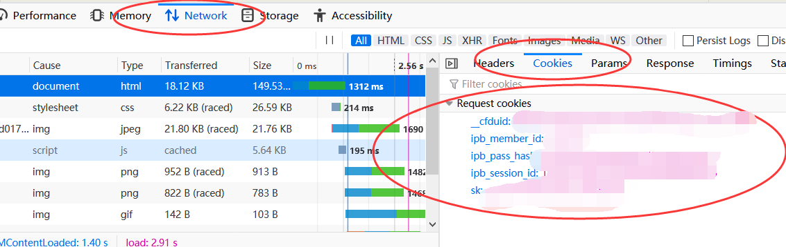

# ex-favor-exporter
此脚本用以图片+名称的方式导出收藏夹

## 安装
```
pip install bs4
pip install rquests
```

## 使用
1. 浏览器中按F12打开开发者工具：
2. 选择 network (网络) 选项
3. 访问 `https://e-hentai.org/favorites.php`
4. 随便点进一个新的请求
5. 按下图找到cookies (以 firefox 为例)

5. 在`ex-favor-exporter.py`文件开头配置cookies：
    ```
    # in ex-favor-exporter.py
    cookies={"__cfduid":"xxx","ipb_member_id":"xxx","ipb_pass_hash":"xxx","ipb_session_id":"xxx","sk":"xxx"}
    ```

7. **运行：**
    ```
    python .\ex-favor-exporter.py
    ```
